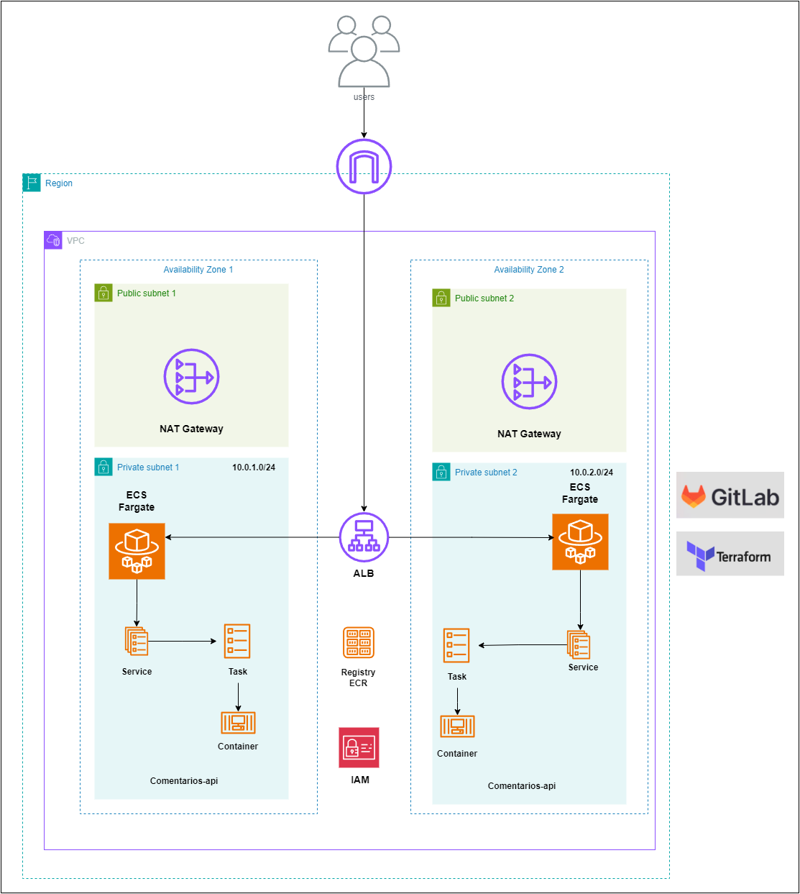

# Automação da infraestrutura

Repositório do projeto [terraform-ecs-fargate](https://gitlab.com/souzafpv/terraform-ecs-fargate), executa a pipeline CI/CD para deploy da infraestrutura ma AWS.


## AWS ECS Fargate
Executando aplicações em contêiner na nuvem sem gerenciar servidores EC2

## Diagrama da Infraestrutura 


## Recursos

- Virtual Private Cloud (VPC)
- Balanceador de Carga de Aplicação (ALB)
- Definição de Cluster, Serviço e Tarefa do ECS
- Gerenciamento de Acesso à Identidade (IAM)
- Grupos Segurança
- Grupo de log do CloudWatch
- Repositório de imagens ECR

## Instalação

Provisionar todos os recursos para executar a Aplicação.

## Configura o TFC
```
    terraform {

    cloud {
        organization = "sua-organizacao-aqui"
        workspaces {
        name = "terraform-ecs"
        }
    }

```
## No Terminal

```bash
$ git clone git@gitlab.com:souzafpv/terraform-ecs-fargate.git
$ cd terraform-ecs-fargate

$ terraform init
$ terraform plan -out=terraform-ecs.plan
$ terraform apply terraform-ecs.plan
```

## Remove todos os recursos da infra provisionada na AWS
```bash
$ terraform destroy -auto-approve
```


## Aplicacao Comentarios API

Este aplicativo pode ser executado completamente usando `Docker` e `docker-compose`. O uso do Docker é recomendado, pois garante que a aplicação seja executada usando versões compatíveis de Python.


```bash
$ docker-compose up comentarios-api
```

Abra no navegador `http://localhost:8080`.

### Executando localmente

Execute os seguintes comandos para inicializar seu ambiente se você não conseguir executar o aplicativo usando Docker

```bash
$ git clone https://github.com/guilhermefpv/comentarios-api.git 
$ cd comentarios-api
$ pip install -r requirements/dev.txt
```